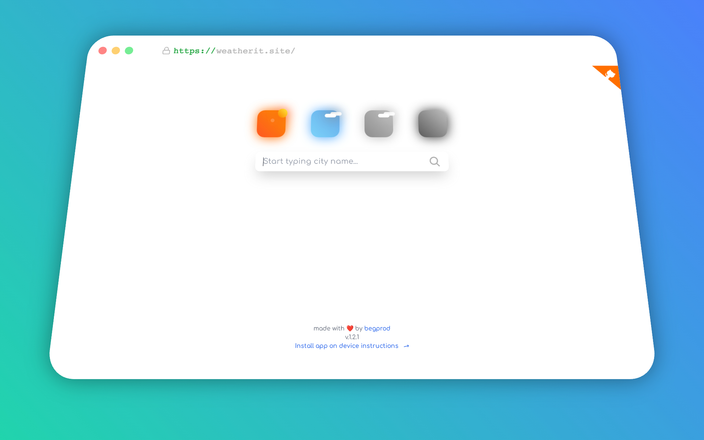
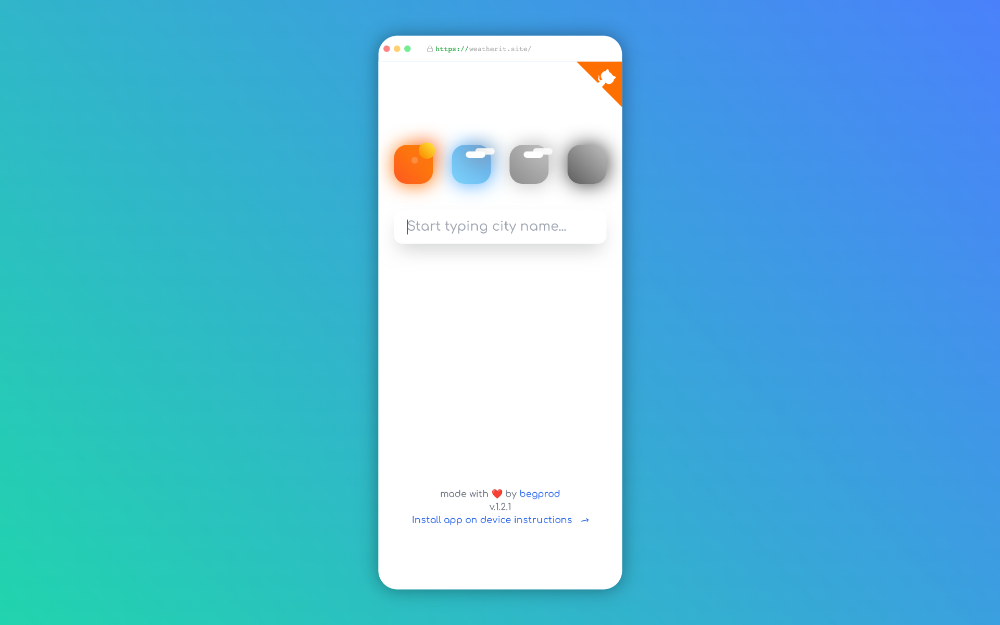
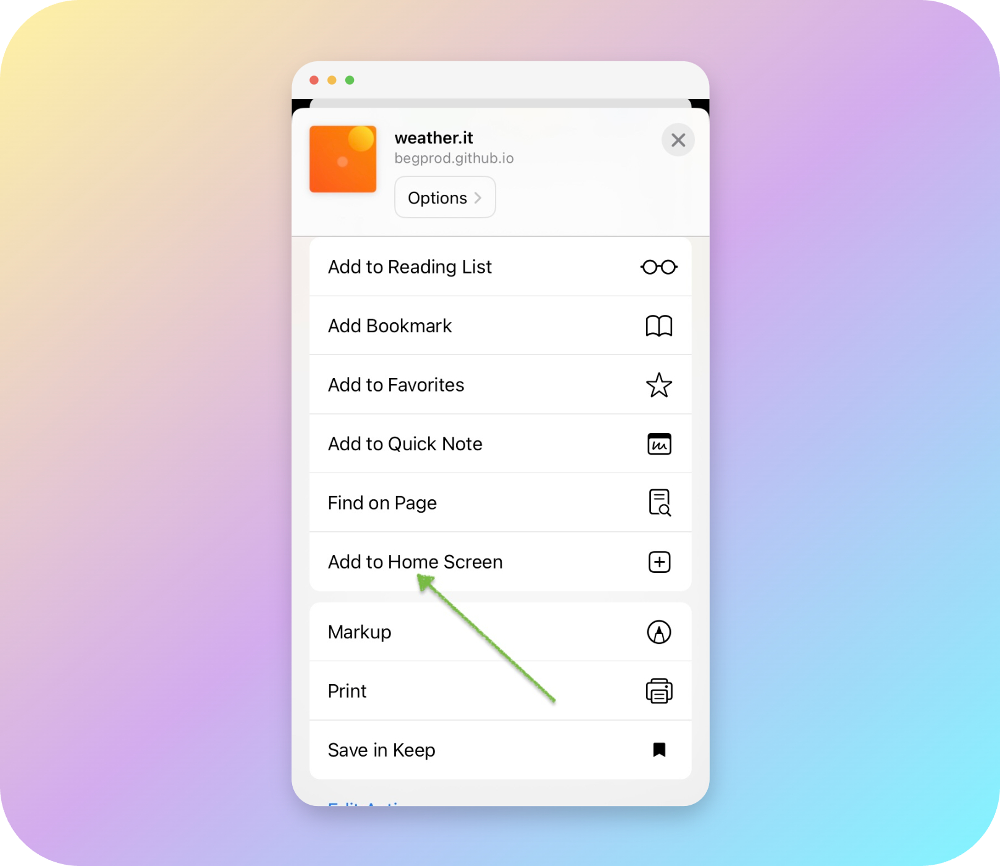

# weather.it

Another weather app with fancy design

[https://weatherit.site/](https://weatherit.site/)


## Features

- City search
- Save selected cities to local storage
- Photos of selected cities
- Air quality

<table>
  <tr>
  <td>
    
  </td>
  <td>
    
  </td>
  </tr>
</table>

<br/>

## Install application on your device

### iOS

Open the following link on your iPhone or iPad: [https://weatherit.site/](https://weatherit.site/)

Follow the steps below to install the app on your device:

<table>
  <tr>
  <td>
    
  </td>
  <td>
    
  </td>
  </tr>
</table>

<br/>

### Android

Open the following link on your Android device: [https://weatherit.site/](https://weatherit.site/)

Follow the steps below to install the app on your device:


## For developers

### Recommended IDE Setup

[VSCode](https://code.visualstudio.com/) + [Vue - Official](https://marketplace.visualstudio.com/items?itemName=Vue.volar)

### Project Setup

```sh
npm install
```

#### Compile and Hot-Reload for Development

```sh
npm run dev
```

#### Take a look other commands in `package.json`

#### Clamp counting cheatsheet

<details>
  <summary>Click to expand</summary>
  The clamp() function in CSS allows you to set a responsive value that adjusts based on the viewport width while staying within a defined minimum and maximum range.
  This guide explains how to calculate clamp() values using a simple formula

### Formula Breakdown

1. Define the maximum value ($max)
   This is the largest possible value in pixels (e.g., 500px).

2. Define the screen width ($screen)
   This represents the base screen width you are working with (e.g., 1280px).
   Calculate 1vw (1% of the viewport width)

3. Calculate 1vw (1% of the viewport width)

```scss
$oneVW = $screen / 100
```

Example: If $screen = 1280px, then 1vw = 1280 / 100 = 12.8px.

4. Convert $max into vw

```scss
$maxVW = $max / $oneVW
```

Example: If $max = 500px and $oneVW = 12.8px, then $maxVW = 500 / 12.8 = 39.06vw.

### Usage in CSS

Once you've calculated the vw equivalent of your max value, you can use it in clamp() like this:

```css
.some-class {
  font-size: clamp(16px, 39.06vw, 500px);
}
```

### Explanation

`16px` → The minimum value (it won't go smaller than this).

`39.06vw` → The dynamic value (scales with viewport width).

`500px` → The maximum value (it won't exceed this).

This ensures the value adapts responsively to the screen size but remains within a reasonable range.

</details>

#### REM counting cheatsheet

<details>
  <summary>Click to expand</summary>

1. Define the base font size ($basefont)

The default browser font size is usually 16px, so we use:

```scss
$basefont = 16;
```

2. Define the pixel value you want to convert ($pixel)

Example: If you need 8px, then:

```scss
$pixel = 8;
```

3. Calculate 1rem equivalent

The formula to convert pixels to rem is:

```scss
$oneRem = $pixel / $basefont;
```

Example

```scss
$oneRem = 8 / 16 = 0.5rem;
```

#### Usage in CSS

Now, instead of using 8px, you can use:

```css
.some-class {
  font-size: 0.5rem;
}
```

This makes your styles more scalable, as rem is relative to the root font size, allowing for better responsiveness and accessibility.

</details>
