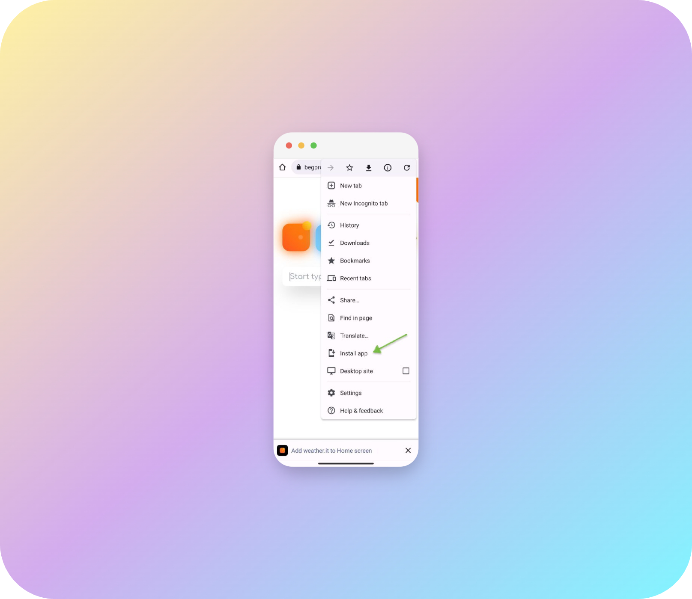

# weather.it

Another weather app with fancy design

[https://weatherit.site/](https://weatherit.site/)


## Features
- City search
- Save selected cities to local storage
- Photos of selected cities
- Air quality

<table>
  <tr>
  <td>
    
  </td>
  <td>
    
  </td>
  </tr>
</table>

<br/>

## Install application on your device

### iOS

Open the following link on your iPhone or iPad: [https://weatherit.site/](https://weatherit.site/)

Follow the steps below to install the app on your device:

<table>
  <tr>
  <td>
    
  </td>
  <td>
    
  </td>
  </tr>
</table>

<br/>

### Android

Open the following link on your Android device: [https://weatherit.site/](https://weatherit.site/)

Follow the steps below to install the app on your device:



## For developers

### Recommended IDE Setup

[VSCode](https://code.visualstudio.com/) + [Volar](https://marketplace.visualstudio.com/items?itemName=Vue.volar) (and disable Vetur) + [TypeScript Vue Plugin (Volar)](https://marketplace.visualstudio.com/items?itemName=Vue.vscode-typescript-vue-plugin).

### Type Support for `.vue` Imports in TS

TypeScript cannot handle type information for `.vue` imports by default, so we replace the `tsc` CLI with `vue-tsc` for type checking. In editors, we need [TypeScript Vue Plugin (Volar)](https://marketplace.visualstudio.com/items?itemName=Vue.vscode-typescript-vue-plugin) to make the TypeScript language service aware of `.vue` types.

If the standalone TypeScript plugin doesn't feel fast enough to you, Volar has also implemented a [Take Over Mode](https://github.com/johnsoncodehk/volar/discussions/471#discussioncomment-1361669) that is more performant. You can enable it by the following steps:

1. Disable the built-in TypeScript Extension
   1. Run `Extensions: Show Built-in Extensions` from VSCode's command palette
   2. Find `TypeScript and JavaScript Language Features`, right click and select `Disable (Workspace)`
2. Reload the VSCode window by running `Developer: Reload Window` from the command palette.

### Project Setup

```sh
npm install
```

#### Compile and Hot-Reload for Development

```sh
npm run dev
```

#### Take a look other commands in `package.json`
