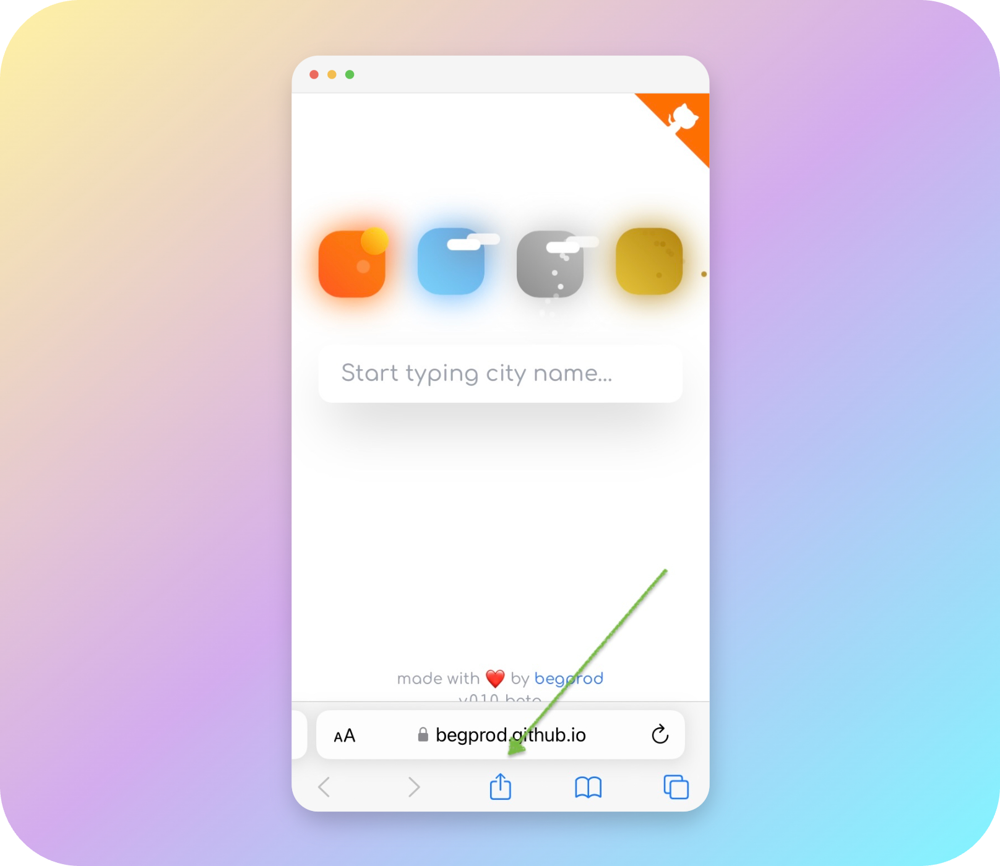

# weather.it

 
 
 

## One more weather app with fancy design

[https://begprod.github.io/weather.it/](https://begprod.github.io/weather.it/)

App includes the ability to search for cities, save selected cities, display current weather for each of them, and loads photos of the cities.

 

 
 
 

## Install application on your device

### iOS

Open the following link on your iPhone or iPad: [https://begprod.github.io/weather.it/](https://begprod.github.io/weather.it/)

Follow the steps below to install the app on your device:

 
 
 

### Android

Open the following link on your Android device: [https://begprod.github.io/weather.it/](https://begprod.github.io/weather.it/)

Follow the steps below to install the app on your device:

